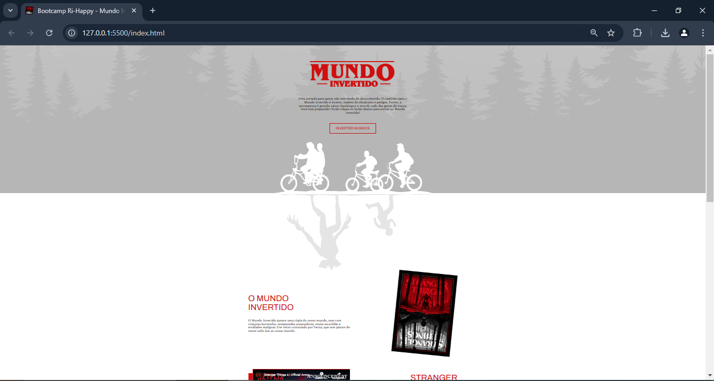
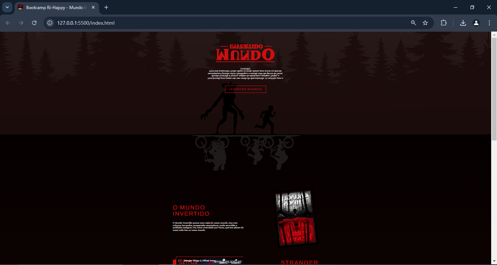
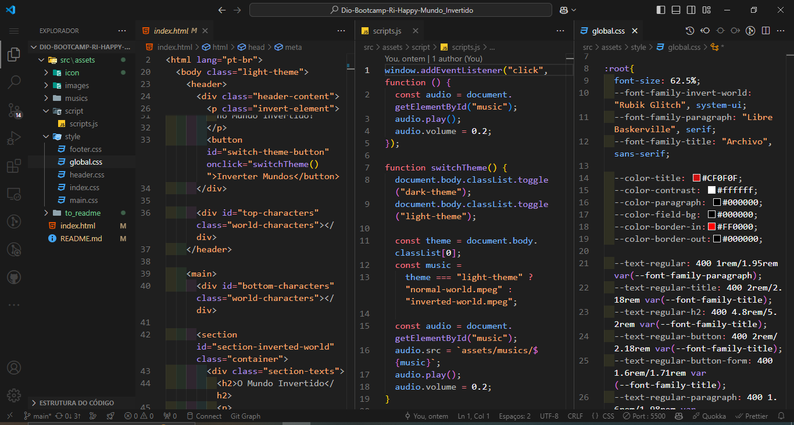
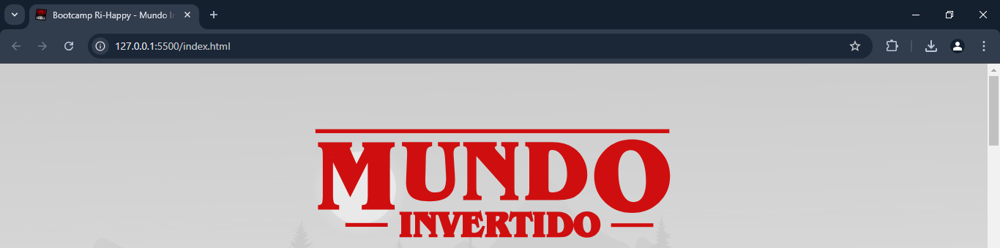

# Dio-Bootcamp_Ri-Happy - Mundo Invertido Stranger Things

Este projeto é uma página inspirada no Mundo Invertido de Stranger Things, apresentada pelos instrutores da DIO, Michele Ambrosio e Diogo Mainardes, como parte do Bootcamp Ri-Happy - Front-end do Zero. O objetivo principal é explorar as possibilidades de estilização com CSS, juntamente com a aplicação de lógica de programação em JavaScript, para criar uma experiência interativa e envolvente. O projeto destaca a manipulação do DOM, integrando recursos dinâmicos e criativos, resultando em uma aplicação funcional e divertida.

## Página de registro das informações sobre o Mundo Invertido Stranger Things

### 📜 Sobre o Projeto

Uma landing page inspirada na série da Netflix Stranger Things, a 2ª série mais assistida da plataforma. Este projeto mergulha no fascinante Mundo Invertido, capturando a atmosfera sombria e envolvente da 4ª temporada, onde os heróis enfrentam desafios ainda mais perigosos e tomam decisões que mudarão suas vidas para sempre. Com uma combinação de estilização avançada em CSS e lógica de programação em JavaScript, esta página cria uma experiência visual e interativa que reflete a essência da série, convidando os usuários a explorar os segredos e perigos do Mundo Invertido.

### 🔗 Links Úteis

- 

- 

### ✅ Status do Projeto

**Concluído**

### 🎥 Deploy

  https://ricardo-werner.github.io/Dio-Bootcamp-Ri-Happy-Mundo_Invertido/

#### Gif da Página do Mundo Invertido 

  

#### Tela Inicial Normal da Página do Mundo Invertido 

  

#### Tela Invertida da Página do Mundo Invertido 

  

#### Tela do código do Código

  

### 🧩 Desafio

  O desafio desse projeto foi trazer todo o ambiente de Stranger Things para a página e traduzir isso em linhas de códigos, recriando o clima tenso e misterioso do Mundo Invertido. A ideia era usar o CSS para dar um visual marcante e o JavaScript para adicionar uma interação e deixar tudo mais dinâmico. O maior trabalho foi conseguir pensar nos opostos da página normal e do mundo invertido e tornar a página envolvente e divertida, enquanto aprendia sobre como fazer tudo isso funcionar junto.

### 📝 Requisitos da Aplicação

| Item  | Descrição                                                                       |
|-------|---------------------------------------------------------------------------------|
|  1    | A página deve ser desenvolvida em HTML, CSS e Javascript                        |
|  1.1  | Base de design no Figma: https://tinyurl.com/22qbgw6f                           |
|  2    | Modelagem do layout, formatos, tipografias, cores e organização livre.          |
|  3    | Adicionar funcionalidade para inverter todo o design da página                  |

### 🚀 Plano do Projeto

No desenvolvimento desta página, foram aplicados os seguintes conceitos:

| Item  | Descrição                                   |
|-------|---------------------------------------------|
|  1    | HTML                                        |
|  2    | CSS                                         |
|  3    | Javascript                                  |

### 🛠 Tecnologias Utilizadas

- **Visual Studio Code**
- **HTML**
- **CSS**
- **Javascript**
- **Documentação**
- **ChatGpt**

### 💡 Reflexões

"Desenvolver este projeto foi mais um marco importante na minha jornada de aprendizado em programação, permitindo-me mergulhar em conceitos mais avançados do CSS e JavaScript. Neste projeto, desenvolvi metodoligias para criar interatividade e dinâmicas que capturam a característica sombria e misteriosa do Mundo Invertido. Trabalhei com manipulação de dados e lógica de programação para dar vida a elementos que refletem os desafios enfrentados pelos heróis na série, recriando a tensão e a atmosfera única de Stranger Things. Este projeto não só expandiu meu entendimento sobre o desenvolvimento web, mas também foi uma oportunidade incrível de unir criatividade e aprendizado em mais uma experiência divertida.

### 📦 Como Executar o Projeto

1. Clone o repositório:
   
    git clone https://github.com/ricardo-werner/Dio-Bootcamp-Ri-Happy-Mundo_Invertido.git

3. Abra o projeto no Visual Studio Code e ative o Go Live:
    
   

     
   

   

     
   

4. Visualize o resultado na página web:

   

     
   

### 🙋‍♂️ Autor
Ricardo Werner 
Dev em Desenvolvimento
